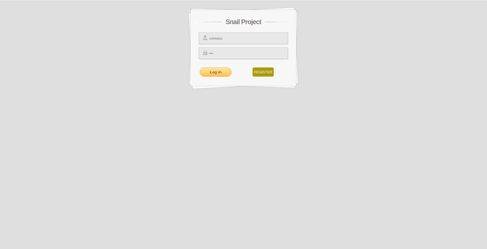

# Snail Project

## 1. Tổng quan

*Snail Project* là một training project thuộc chương trình ZaloPay Fresher 2020 sử dụng React JS, Vert.x để xây dụng một ứng dụng chat real-time + digital wallet đơn giản bao gồm các chức năng cơ bản:

- Chat:
  - Đặng nhập / Đăng xuất (có sử dụng JWT)
  - Đăng ký tài khoản
  - Xem danh sách tất cả người dùng trong hệ thống
  - Chat 1 - 1
- Wallet:
  - Xem số dư của tài khoản
  - Gửi tiền cho một user trong hệ thống
  - Xem lịch sử giao dịch

Các công nghệ sử dụng:

- `React`, `Redux` cho client
- `Java Vert.x` xây dựng API cho server
- `WebSocket` gửi nhận tin nhắn real time
- Database dùng `MySQL`
- `gRPC` cho các chức năng của wallet

## 2. Chi tiết

- [RestAPI Sequence diagrams](docs/chatapp/Sequence-Diagram.md)
- [RestAPI và Websocket Specifications](https://app.swaggerhub.com/apis/minhduc2803/Snail-Project/1.0.0)
- [gRPC API Sequence diagrams](docs/paymentapp/README.md)
- [gRPC proto file](docs/paymentapp/grpc-api/fintech.proto)
- [Database design](images/mysql/current-fintech-diagram.png)
- [Benchmark cho wallet](docs/paymentapp/benchmark.md)
  
## 3. Hướng dẫn chạy

- Client chạy trên port 3000. Có dùng `yarn` để build
  
```shell script
    yarn install
```

và khởi động

```shell script
    yarn start
```

- Vert.x server có API chạy trên port 8055, WebSocket chạy trên port 9009, gRPC chạy trên port 8000, Prometheus chạy trên port 8054. Dùng `maven` để build và run.

Build server
  
```shell script
mvn clean install
```

Run server
  
```shell script
java -Dservice.conf=./conf/development.yaml
-Dlog4j.configurationFile=./conf/log4j.xml
-Dredis.conf=./conf/redis.yaml
-cp *.jar bla.nah.example.Runner
```

- Envoy proxy chuyển tiếp gói tin gRPC từ port 8080 tới port 8000 của server

```shell script
docker-compose up -d
```
  
## 4. Demo

### 3.1 Login



### 3.2 Register


### 3.3 View User List


### 3.4 Chat 1 - 1


### 3.5 Xem balance và transfer history


### 3.6 Giao diện chuyển tiền

- Chuyển tiền


- Chuyển tiền thành công


- Chuyển tiền thất bại


### 3.7 Log out

