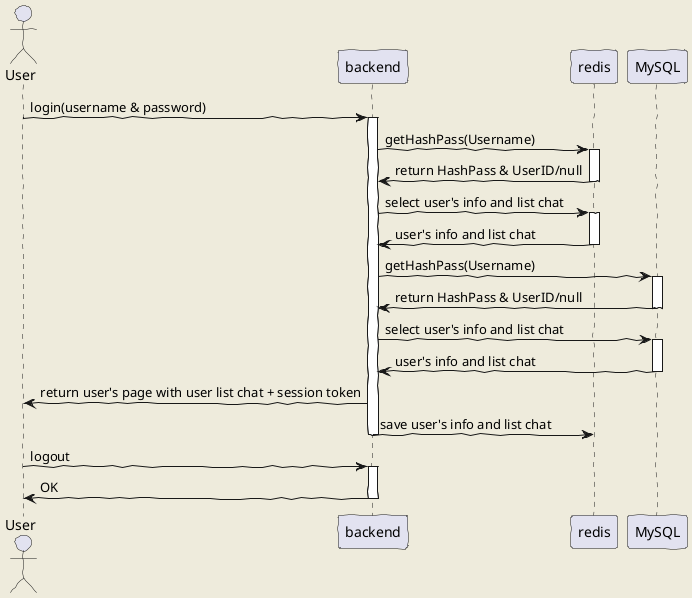
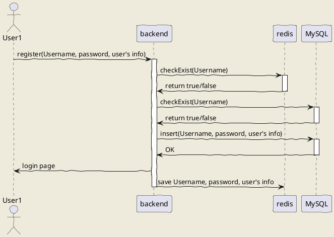
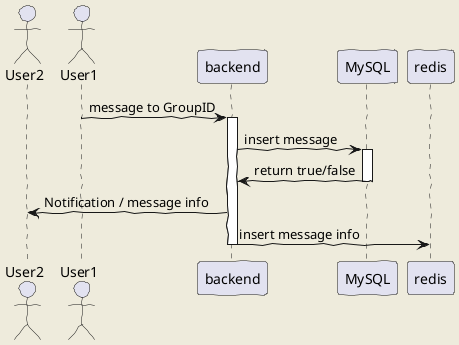
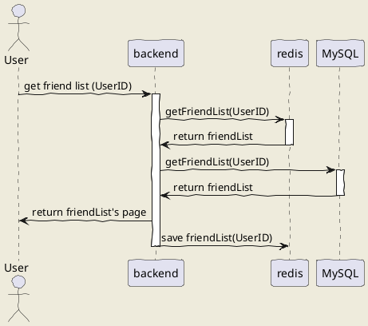
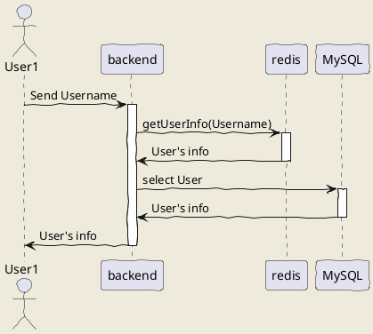
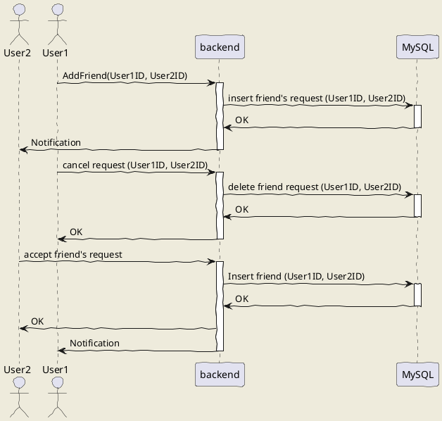
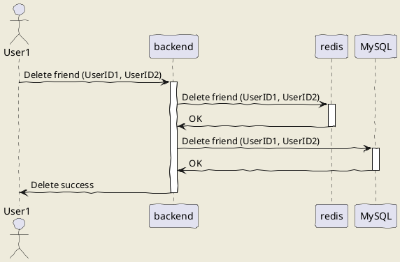

## Login

```plantuml
@startuml
    skinparam backgroundColor #EEEBDC
    skinparam handwritten true
    actor User
    User -> "backend" : login(username & password)
    activate "backend"
    backend -> "redis" : getHashPass(Username)
    activate "redis"
    "redis" -> "backend" : return HashPass & UserID/null
    deactivate "redis"
    "backend" -> "redis" : select user's info and list chat
    activate "redis"
    "redis" -> "backend" : user's info and list chat
    deactivate "redis"
    backend -> "MySQL" : getHashPass(Username)
    activate "MySQL"
    "MySQL" -> "backend" : return HashPass & UserID/null
    deactivate "MySQL"
    "backend" -> "MySQL" : select user's info and list chat
    activate "MySQL"
    "MySQL" -> "backend" : user's info and list chat
    deactivate "MySQL"
    "backend" -> User : return user's page with user list chat + session token
    "backend" -> "redis" : save user's info and list chat
    deactivate "backend"

    User -> "backend" : logout
    activate "backend"
    "backend" -> User : OK
    deactivate "backend"
@enduml
```

## Register

```plantuml
@startuml
    skinparam backgroundColor #EEEBDC
    skinparam handwritten true
    actor User1
    User1 -> "backend" : register(Username, password, user's info)
    activate "backend"
    backend -> "redis" : checkExist(Username)
    activate "redis"
    "redis" -> "backend" : return true/false
    deactivate "redis"
    "backend" -> "MySQL" : checkExist(Username)
    activate "MySQL"
    "MySQL" -> "backend" : return true/false
    deactivate "MySQL"
    backend -> "MySQL" : insert(Username, password, user's info)
    activate "MySQL"
    "MySQL" -> "backend" : OK
    deactivate "MySQL"
    "backend" -> User1 : login page
    "backend" -> "redis" : save Username, password, user's info
    deactivate "backend"
@enduml
```

## Send Message

```plantuml
@startuml
    skinparam backgroundColor #EEEBDC
    skinparam handwritten true
    actor User2
    actor User1
    User1 -> "backend" : message to GroupID
    activate "backend"
    backend -> "MySQL" : insert message
    activate "MySQL"
    "MySQL" -> "backend" : return true/false
    deactivate "MySQL"
    "backend" -> User2 : Notification / message info
    "backend" -> "redis" : insert message info
    deactivate "backend"
@enduml
```

## Get friend list

```plantuml
@startuml
    skinparam backgroundColor #EEEBDC
    skinparam handwritten true
    actor User
    User -> "backend" : get friend list (UserID)
    activate "backend"
    backend -> "redis" : getFriendList(UserID)
    activate "redis"
    "redis" -> "backend" : return friendList
    deactivate "redis"
    "backend" -> "MySQL" : getFriendList(UserID)
    activate "MySQL"
    "MySQL" -> "backend" : return friendList
    deactivate "MySQL"
    "backend" -> User : return friendList's page
    "backend" -> "redis" : save friendList(UserID)
    deactivate "backend"
@enduml
```

## Search user

```plantuml
@startuml
    skinparam backgroundColor #EEEBDC
    skinparam handwritten true
    actor User1
    User1 -> "backend" : Send Username
    activate "backend"
    backend -> "redis" : getUserInfo(Username)
    activate "redis"
    "redis" -> "backend" : User's info
    deactivate "redis"
    "backend" -> "MySQL" : select User
    activate "MySQL"
    "MySQL" -> "backend" : User's info
    deactivate "MySQL"
    "backend" -> "User1" : User's info
    deactivate "backend"
@enduml
```

## Add friend

```plantuml
@startuml
    skinparam backgroundColor #EEEBDC
    skinparam handwritten true
    actor User2
    actor User1
    User1 -> "backend" : AddFriend(User1ID, User2ID)
    activate "backend"
    backend -> "MySQL" : insert friend's request (User1ID, User2ID)
    activate "MySQL"
    "MySQL" -> "backend" : OK
    deactivate "MySQL"
    "backend" -> "User2" : Notification
    deactivate "backend"

    User1 -> "backend" : cancel request (User1ID, User2ID)
    activate "backend"
    "backend" -> "MySQL" : delete friend request (User1ID, User2ID)
    activate "MySQL"
    "MySQL" -> "backend" : OK
    deactivate "MySQL"
    "backend" -> User1 : OK
    deactivate "backend"

    User2 -> "backend" : accept friend's request
    activate "backend"
    "backend" -> "MySQL" : Insert friend (User1ID, User2ID)
    activate "MySQL"
    "MySQL" -> "backend" : OK
    deactivate "MySQL"
    "backend" -> User2 : OK
    "backend" -> User1 : Notification
    deactivate "backend"
@enduml
```

## Delete friend

```plantuml
@startuml
    skinparam backgroundColor #EEEBDC
    skinparam handwritten true
    actor User1
    User1 -> "backend" : Delete friend (UserID1, UserID2)
    activate "backend"
    backend -> "redis" : Delete friend (UserID1, UserID2)
    activate "redis"
    "redis" -> "backend" : OK
    deactivate "redis"
    "backend" -> "MySQL" : Delete friend (UserID1, UserID2)
    activate "MySQL"
    "MySQL" -> "backend" : OK
    deactivate "MySQL"
    "backend" -> "User1" : Delete success
    deactivate "backend"
@enduml
```
