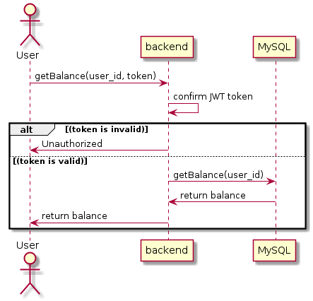
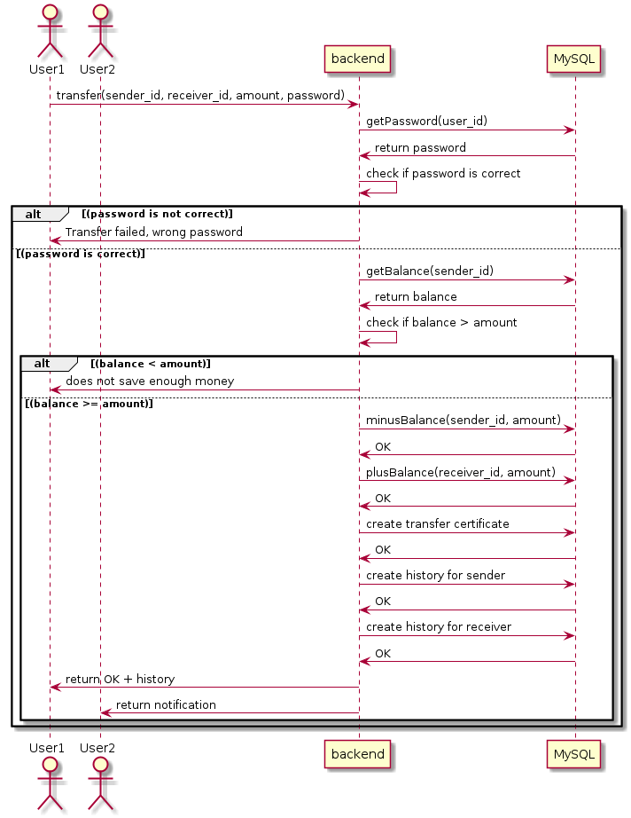
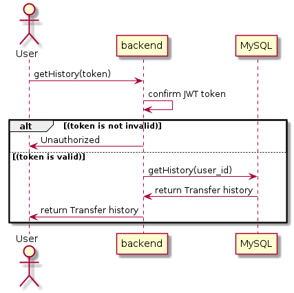
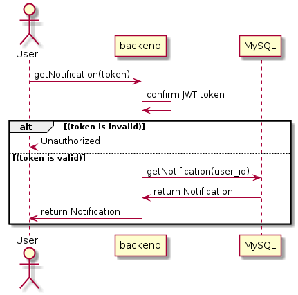
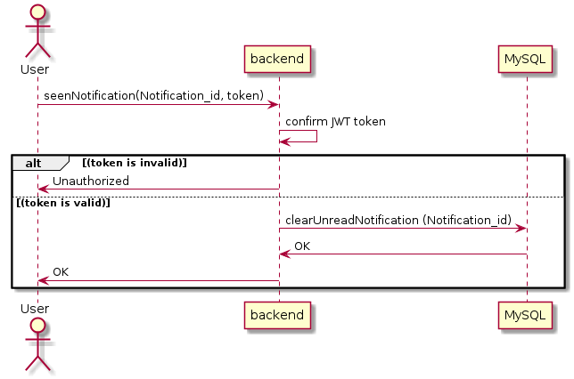
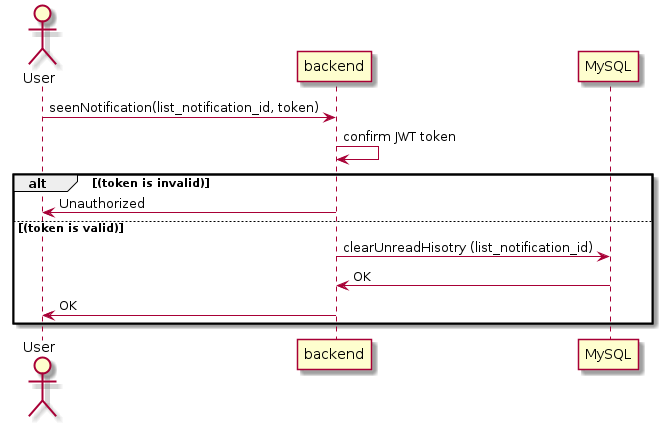
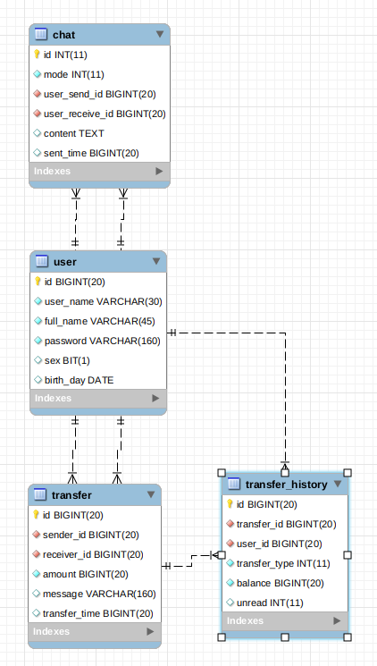

# Payment App

## 1. Balsamiq mockups 3

[Snail Project mockup](https://balsamiq.cloud/sgfegwz/pk5dnoi)

## 2. API and Sequence diagram

### GRPC API

[.proto file](grpc-api/fintech.proto)

### Sequence diagram

#### 1. Get balance

#### 2. Transfer

#### 3. Get transfer history

#### 4. Get notifications

#### 5. Seen a notification

#### 5. Seen all notifications

## 3. Database schema

