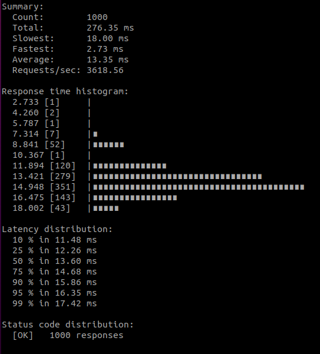

# Benchmark for Fintech Service

| Snail Project | 1.0-SNAPSHOT |
|---------------|-----------------|
| Vertx | 3.7.0 |
| gRPC | 1.16.1 |
| mySQL | 8.0.11 |
| hikariCP | 3.3.1 |

Sử dụng ghz để benckmark
Mọi request đều phải đi qua envoy proxy để tới được backend server

## 1. Get balance

Gửi 1000 getBalance request với. Tham số concurrent = 50

|Tổng thời gian thực hiên| Requests/sec | p99 |
|------------------------|--------------|-----|
|276.35 ms | 3618.56 | 17.42 |

Kết quả chi tiết:

## 2. Get transfer history

Gửi 1000 getHistory request với. Tham số concurrent = 50

|Tổng thời gian thực hiên| Requests/sec | p99 |
|------------------------|--------------|-----|
|269.59 ms | 3709.29 | 19.15 |

Kết quả chi tiết:

## 3. Transfer money

Gửi 1000 transfer request gửi tiền từ 1 account tới một 1 account khác. Tham số concurrent = 20

|Tổng thời gian thực hiên| Requests/sec | p99 |
|------------------------|--------------|-----|
|3.13 s | 319.31 | 87.97 |

Kết quả chi tiết:

